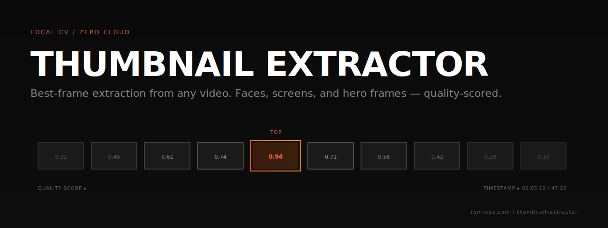

<p align="center">
  
</p>

<h1 align="center">PodLab | Thumbnail Extractor</h1>

<p align="center">
  <strong>Extract the best thumbnails from any podcast or video — automatically.</strong>
</p>

<p align="center">
  <a href="#quickstart">Quickstart</a> •
  <a href="#features">Features</a> •
  <a href="#training-your-own-categories">Train</a> •
  <a href="docs/TRAINING.md">Docs</a> •
  <a href="#license">License</a>
</p>

---

**PodLab Thumbnail Extractor** is an open-source, locally-run AI tool that scans your video and returns the highest-quality faces, screen captures, and hero frames, ranked by a computer-vision quality scorer. Train it on your own taste with the built-in custom model UI. No cloud, no subscription, no upload limits.

Use it to pick YouTube thumbnails for podcast episodes, bulk-generate preview candidates for long recordings, extract screenshot-worthy moments from demo segments, or anything else where the right still matters.

## Quickstart

**Windows (one-click):**

```
git clone https://github.com/REMvisual/podcast-thumbnail-extractor
cd podcast-thumbnail-extractor
install.bat
run.bat
```

Then open <http://localhost:5000>.

**Linux / macOS:**

```
git clone https://github.com/REMvisual/podcast-thumbnail-extractor
cd podcast-thumbnail-extractor
./install.sh
source venv/bin/activate
python src/app.py
```

**Requires:** Python 3.10+, ~2 GB disk (includes starter models), Windows 10/11 (Linux/mac best-effort).

## Features

- **Three detection modes out of the box:** faces, screen captures (UI and art variants), and a catch-all "everything" mode.
- **Quality-ranked output:** each candidate thumbnail gets a 0.0–1.0 score; top 10 are kept per video.
- **Scene-aware sampling:** doesn't waste cycles on static shots; pulls representative frames from distinct scenes.
- **Near-duplicate deduplication:** ten unique keepers, not ten copies of the same smile.
- **Background removal:** optional `rembg`-powered cutout for clean compositing into thumbnail templates.
- **Train your own categories:** add a `firetrucks` category, give it a folder of good and bad examples, hit Train — a CNN learns your taste.
- **Fully local:** no telemetry, no cloud, no uploads. Your video never leaves your machine.

## Training your own categories

See [`docs/TRAINING.md`](docs/TRAINING.md) for the full walkthrough. Short version:

1. Launch `config.bat` — opens the category manager in your browser.
2. Click "Add Category" — give it an ID, a label, an emoji, and a training-data folder with `good/` and `bad/` subfolders of ~50 example images each.
3. Click "Train" — watch the live progress. Training takes 5-15 minutes on a modern CPU; GPU speeds that up.
4. Your new category shows up on the main page. Pick it when extracting and the CNN ranks frames by how well they match your `good/` examples.

## Image sources for training

[`docs/IMAGE_SOURCES.md`](docs/IMAGE_SOURCES.md) lists free / CC0 sources for building training sets: Pexels, Unsplash, Openverse, and more. Don't use copyrighted images.

## Configuration

All runtime paths are env-var overridable:

| Variable | Default | Purpose |
|---|---|---|
| `THUMBNAIL_EXTRACTOR_UPLOAD_DIR` | `./uploads` | Video scratch |
| `THUMBNAIL_EXTRACTOR_OUTPUT_DIR` | `./outputs` | Thumbnail output |
| `THUMBNAIL_EXTRACTOR_MODEL_DIR` | `./models` | CNN model storage |
| `THUMBNAIL_EXTRACTOR_CONFIG_PATH` | `./config/categories.json` | Category config |
| `THUMBNAIL_EXTRACTOR_PORT` | `5000` | Flask port |

See [`docs/CONFIG.md`](docs/CONFIG.md) for the full category config schema.

## How it works

1. Upload a video — stored temporarily in `uploads/`.
2. Frame sampling — scene-boundary detection + adaptive sampling pulls representative frames.
3. Per-frame analysis — face detection (OpenCV), heuristic quality scoring (sharpness + brightness + contrast), content classification.
4. Optional CNN ranking — if a category has a trained `.pth`, it reranks candidates by learned preference.
5. Near-duplicate filter — visually-similar frames collapse to one representative.
6. Top-10 export — full-resolution JPGs + optional background-removed variants.

All processing happens on your machine. No frame ever touches the cloud.

## Related projects

Part of the **PodLab** suite of podcast-production tools (more coming).

## Contributing

PRs welcome. See [CHANGELOG.md](CHANGELOG.md) for release history.

## License

[MIT](LICENSE) — do whatever, but don't sue us.
